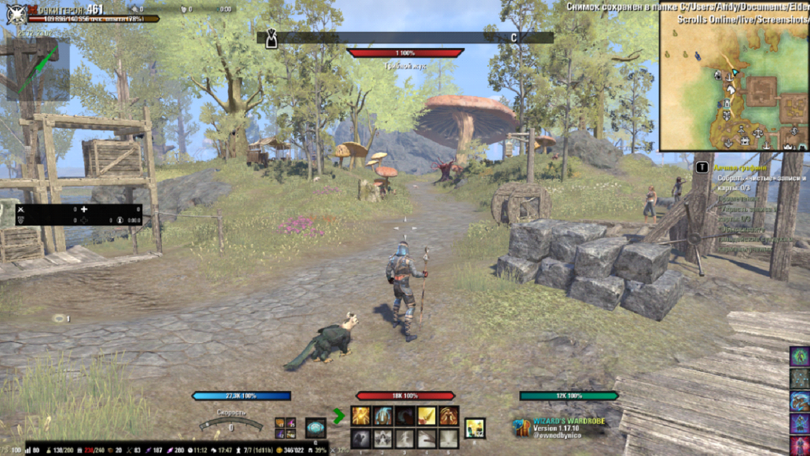
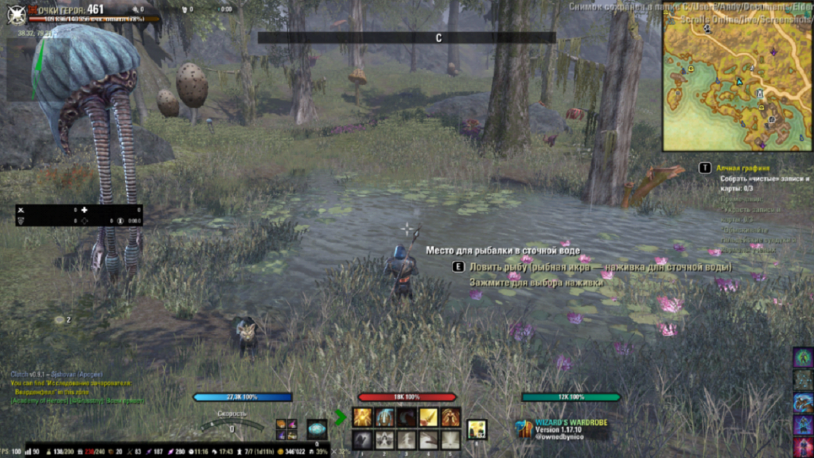
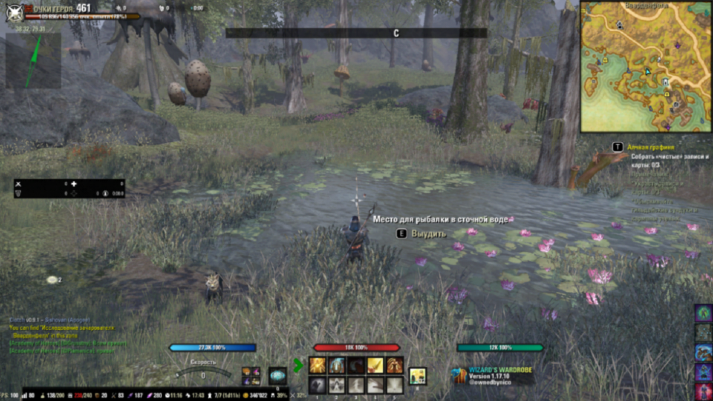
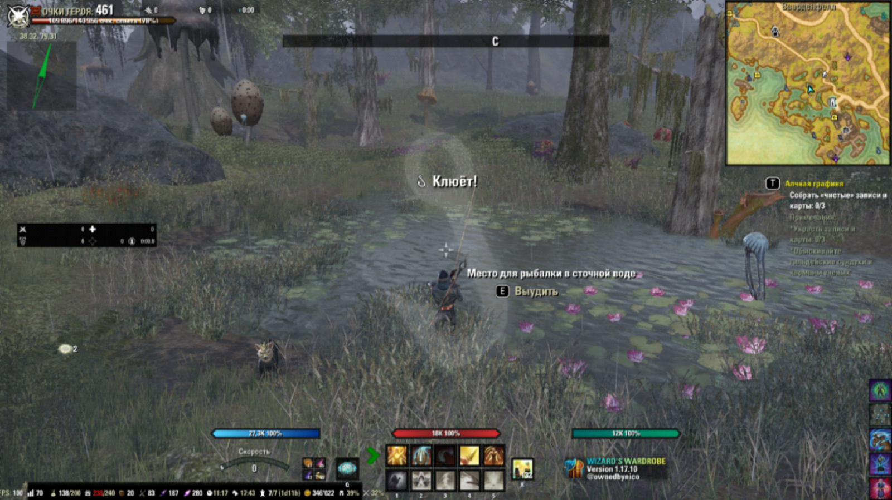
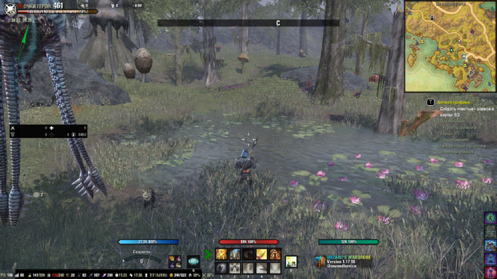
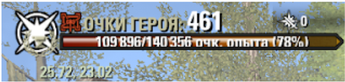
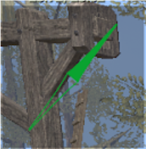
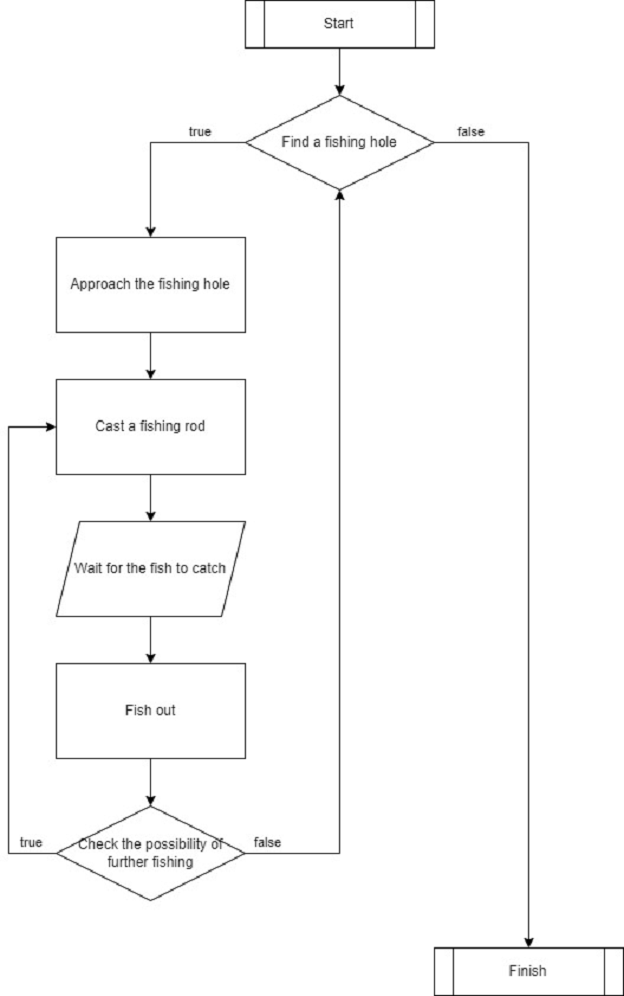

# TESO Fisher

Техническая спецификация

## СОДЕРЖАНИЕ

[Введение](#введение)  
[Общее описание](#1-общее-описание)  
1 [Системная среда](#11-системная-среда)  
1.2 [Рыбалка в TESO](#12-рыбалка-в-teso)  
1.3 [Спецификация функциональных требований](#13-спецификация-функциональных-требований)  
2 [Подготовка данных](#2-подготовка-данных)  
2.1 [Текущее положение игрового персонажа](#21-текущее-положение-игрового-персонажа)  
2.2 [Компас в игре](#22-компас-в-игре)  
2.3 [Матрица лунок и способов их достижения](#23-матрица-лунок-и-способов-их-достижения)  
3 [Проектирование](#3-проектирование)  
3.1 [Функциональные требования](#31-функциональные-требования)  
3.1.1 [Перемещение персонажа к лунке FRS_TESO_FISHER_010000](#311-перемещение-персонажа-к-лунке-frs_teso_fisher_010000)   
3.1.2 [Определение наличия рыбы в лунке FRS_TESO_FISHER_020000](#312-определение-наличия-рыбы-в-лунке-frs_teso_fisher_020000)  
3.1.3 [Автоматически ловить рыбу в лунке FRS_TESO_FISHER_030000](#313-автоматически-ловить-рыбу-в-лунке-frs_teso_fisher_030000)  
3.2 [Тестовая спецификация](#32-тестовая-спецификация)   
[СПИСОК ИСТОЧНИКОВ](#список-источников)

---

## Введение

Обзор: Данная спецификация описывает алгоритм работы TESO Fisher.

Объём проекта: Программное обеспечение TESO Fisher должно обеспечивать автоматическую ловлю рыбы в игре The Elder
Scrolls Online.

Глоссарий:

- ПО – программное обеспечение.
- TESO – название игры The Elder Scrolls Online.

Ссылки:

Обзор продукта:

---

## 1 Общее описание

### 1.1 Системная среда

Для реализации продукта используется среда разработки PyCharm и объектно-ориентированный язык программирования Python.
Также используются следующие библиотеки Python:

- _Keyboard_ обеспечивает полный контроль над клавиатурой
- _Mouse_ обеспечивает полный контроль над мышью;
- _NetworkX_ пакет Python для создания, управления и изучения структуры, динамики и функций сложных сетей (графов);
- _Numpy_ используется для работы с многомерными массивами;
- _Pillow_ обеспечивает поддержку форматов файлов, внутреннее представление и возможности обработки изображений;
- _Pytest_ используется для написания различных типов тестов программного обеспечения.

### 1.2 Рыбалка в TESO

Игрок появляется в открытом мире, где ему необходимо поймать рыбу (Рисунок 1.1 Игрок в открытом мире).

<p align="center">
    
</p>
<p align="center">Рисунок 1.1. Игрок в открытом мире</p>

Для этого необходимо найти лунку с рыбой на карте и подойти к ней (Рисунок 1.2. Лунка с рыбой).

<p align="center">
    
</p> 
<p align="center"> Рисунок 1.2. Лунка с рыбой</p>

Подойдя к лунке, нужно забросить удочку и дождаться соответствующего сигнала поимки рыбы (Рисунок 1.3. Игрок забросил
удочку).

<p align="center">
    
</p> 
<p align="center">Рисунок 1.3. Игрок забросил удочку</p>

Сигнал поимки рыбы означает что рыбу необходимо выудить (Рисунок 1.4. Выудить рыбу с лунки).

<p align="center">
    
</p> 
<p align="center">Рисунок 1.4. Выудить рыбу с лунки</p>

Выудив рыбу необходимо проверить возможность дальнейшей рыбалки и если таковая есть, то ловить рыбу до тех пор, пока
такой возможности не будет (Рисунок 1.5. Пустая лунка).

<p align="center">
    
</p> 
<p align="center">Рисунок 1.5. Пустая лунка</p>

Выудив всю рыбу с лунки, нужно найти другую лунку и направится к ней. С этого момента все действия должны повторятся
вновь.

### 1.3 Спецификация функциональных требований

> [FRS_TESO_FISHER_010000](#311-перемещение-персонажа-к-лунке-frs_teso_fisher_010000)
> ПО должно перемещать персонажа к потенциальному месту лунки.

> [FRS_TESO_FISHER_020000](#312-определение-наличия-рыбы-в-лунке-frs_teso_fisher_020000)
> ПО должно определять, что в лунке есть рыба.

> [FRS_TESO_FISHER_030000](#313-автоматически-ловить-рыбу-в-лунке-frs_teso_fisher_030000)
> ПО должно автоматически ловить рыбу в лунке.

---

## 2 Подготовка данных

Для того чтобы иметь возможность управлять персонажем в игровом мире необходимо извлечь данные, которые будут отражать
поведение игрока и игрового мира. Так как напрямую данные из игры получит нельзя, используем следующие модификации для
вывода данных на главный экран:

- ESOlocate: это легкое дополнение, которое предоставляет координаты зоны и местоположения [1];
- YetAnotherCompass: этот аддон отображает компас в центре экрана. Конфигурацию компаса можно изменить через меню (
  размер, цвет, стиль) [2];
- Votan's Fisherman: аддон для рыбалки, показывающий рыбные места и лучшие наживки. Этот аддон показывает на карте
  рыбные
  места, советует какую наживку необходимо использовать, а кроме этого, с помощью звуковых и визуальных сигналов
  подсказывает, когда нужно подсекать [3].

В папке “C:\Users\$USER_NAME$\Documents\Elder Scrolls Online\live\SavedVariables” находится файлы системных переменных
для всех аддонов TESO. Нам понадобятся данные из двух файлов системных переменных: для аддона ESOlocate - ESOlocate.lua,
для аддона YetAnotherCompass - YetAnotherCompass.lua.

Также необходимо сформировать матрицу лунок и способов их достичь.

### 2.1 Текущее положение игрового персонажа

Для отслеживания текущего положения персонажа используется аддон ESOlocate который выводит на экран координаты текущего
положения персонажа (Рисунок 2.1. Аддон ESOlocate).

<p align="center">
    
</p> 
<p align="center">Рисунок 2.1. Аддон ESOlocate</p>

В файл “ESOlocate.lua” содержится информация о положении окна мода ESOlocate на экране. Файл имеет структуру словаря, а
также содержит информацию о пользователе и игровом персонаже так как все настройки окна вывода индивидуальны для каждого
игрового персонажа.

Структура файла ESOlocate.lua:

```lua
ESOlocate_SavedVars = {
    ["Default"] = {
        ["@$USER_NAME$"] = {
            ["$CHAMPION_NAME$"] = {
                ["ESOlocate"] = {
                    [0] = x_position,
                    [1] = y_position,
                    [2] = sector,
                    [3] = sector2,
                    ["version"] = 1,
                    [5] = true,
                },
            },
        },
    },
}
```

В строке 1 содержится имя системной переменной, в которую записана вся информация.

В строке 3 указан ключ единственного элемента словаря ESOlocate_SavedVars - ```["Default"]```. В нем содержится
информация об авторизированных пользователях в виде словаря, где ключом выступает имя пользователя в
формате ```[“@user_name”]``` (строка 5).

Элемент ```["@$USER_NAME$"]``` содержит в себе информацию о всех персонажах пользователя, указанного в ключе элемента, в
виде словаря, где ключом выступает имя персонажа в формате ```[“champion_name”]``` (строка 7).

Элемент ```["$CHAMPION_NAME$"]``` содержит в себе словарь с единственным ключом ```["ESOlocate"]``` (строка 9).

Элемент ```["ESOlocate"]``` – это словарь из шести ключей.

Ключ ```[0]``` – тип: int, смещение координаты “x” относительно сектора, указанного в ключе ```[2]```.

Ключ ```[1]``` – тип: int, смещение координаты “y” относительно сектора, указанного в ключе ```[2]```.

Ключ ```[2]``` – тип: int, номер сектора.

Ключ ```[3]``` – тип: int, “выглядит как ключ ```[2]```” номер сектора.

Ключ ```["version"]``` – тип: int, версия чего-то.

Ключ ```[5]``` – тип: bool, возможность перемещать окно вывода (“true” – можно перемещать; “false” – статическое
положение окна вывода).

### 2.2 Компас в игре

Для отображения компаса на экране используется аддон YetAnotherCompass (Рисунок 2.2. Аддон YetAnotherCompass).

<p align="center">
    
</p> 
<p align="center">Рисунок 2.2. Аддон YetAnotherCompass</p>

Структура файла YetAnotherCompass.lua:

```lua
YetAnotherCompassVars = {
    ["Default"] = {
        ["@$USER_NAME$"] = {
            ["$AccountWide"] = {
                ["size"] = 150,
                ["position"] = {
                    ["x"] = 288,
                    ["y"] = 71,
                },
                ["compassStyle"] = 17,
                ["color"] = {
                    ["G"] = 1,
                    ["R"] = 0,
                    ["A"] = 1,
                    ["B"] = 0.2500000000,
                },
                ["version"] = 1,
                ["centered"] = false,
            },
            ["$CHAMPION_NAME$"] = {
                ["pvpEnabled"] = true,
                ["pveEnabled"] = true,
                ["version"] = 1,
                ["movableCompass"] = false,
                ["combatEnabled"] = true,
                ["isEnabled"] = true,
            },
        },
    },
}
```

В файл “YetAnotherCompass.lua” содержится информация о положении окна мода YetAnotherCompass на экране. Файл имеет
структуру словаря, а также содержит информацию о пользователе и игровом персонаже. Конфигурация положения компаса общая
для всех персонажей, а настройки окна вывода индивидуальны для каждого игрового персонажа.

В строке 1 содержится имя системной переменной, в которую записана вся информация.

В строке 3 указан ключ единственного элемента словаря YetAnotherCompassVars - ```["Default"]```. В нем содержится
информация об авторизированных пользователях в виде словаря, где ключом выступает имя пользователя в формате
```[“@user_name”]``` (строка 5).

Элемент```["@$USER_NAME$"]``` содержит в себе словари, где ключом выступает имя персонажа в формате
```[“champion_name”]``` (строка 26) и словарь с ключом ```["$AccountWide"]``` (строка 7).

Элемент ```["$AccountWide"]``` – это словарь из шести ключей.

Ключ ```["size"]``` – тип: int, размер окна.

Ключ ```["position "]``` – тип: dict, содержит ключи ```["x"]``` и ```["y"]```.

Ключ ```["x"]``` – тип: int, координата “x” положения окна.

Ключ ```["y"]``` – тип: int, координата “y” положения окна.

Ключ ```["compassStyle "]``` – тип: int, номер стиля компаса.

Ключ ```["color "]``` – тип: dict, описывает цвет стрелки компаса. Содержит ключи ```["G"]```, ```["R"]```, ```["A"]```
и ```["B"]```.

Ключ ```["G"]``` – тип: float, зеленый.

Ключ ```["R"]``` – тип: float, красный.

Ключ ```["A"]``` – тип: float, яркость.

Ключ ```["B"]``` – тип: float, синий.

Ключ ```["version "]``` – тип: int, версия чего-то.

Ключ ```["centered "]``` – тип: bool, (“true” – окно по центру; “false” – нет привязки к центру).

Элемент ```["$CHAMPION_NAME$"]``` – это словарь из шести ключей.

Ключ ```["pvpEnabled "]``` – тип: bool, (“true” – отображать окно в “PVP” режиме; “false” – не отображать окно в “PVP”
режиме).

Ключ ```["pveEnabled "]``` – тип: bool, (“true” – отображать окно в “PVE” режиме; “false” – не отображать окно в “PVE”
режиме).

Ключ ```["version "]``` – тип: int, версия чего-то.

Ключ ```["movableCompass "]``` – тип: bool, возможность перемещать окно вывода (“true” – можно перемещать; “false” –
статическое положение окна вывода).

Ключ ```["isEnabled "]``` – тип: bool, (“true” – отображать окно; “false” – не отображать окно).

### 2.3 Матрица лунок и способов их достижения.

---

## 3 Проектирование

### 3.1 Функциональные требования

> #### [FRS_TESO_FISHER_010000](#311-перемещение-персонажа-к-лунке-frs_teso_fisher_010000)
>ПО должно перемещать персонажа к потенциальному месту лунки.

> #### [FRS_TESO_FISHER_020000](#312-определение-наличия-рыбы-в-лунке-frs_teso_fisher_020000)
>ПО должно определять, что в лунке есть рыба.

> #### [FRS_TESO_FISHER_030000](#313-автоматически-ловить-рыбу-в-лунке-frs_teso_fisher_030000)
>ПО должно автоматически ловить рыбу в лунке.


Основные функциональные требования можно представить в виде следующей диаграммы (Рисунок 3.1. Основной алгоритм):

<p align="center">
    
</p> 
<p align="center">Рисунок 3.1. Основной алгоритм</p>

### 3.1.1 Перемещение персонажа к лунке [FRS_TESO_FISHER_010000](#frs_teso_fisher_010000)

> #### FRS_TESO_FISHER_010100
> Определить текущее положение персонажа. Необходимо по вызову функции получить координаты текущего положения персонажа
> в виде пары значений типа float.
>- [ ] *test specification exists*

> #### FRS_TESO_FISHER_010101
> Определить положение и размер окна ESOlocate. Данные о размере и положении окна ESOlocate должны быть распарщены из
> соответствующего файла и представлены в виде класса.
>- [ ] *test specification exists*

> #### FRS_TESO_FISHER_010102
> Получить изображение окна координат. Необходимо по вызову функции получить изображение окна координат
> соответствующего размера и положения, удовлетворяющих требованию [FRS_TESO_FISHER_010101](#frs_teso_fisher_010101).
>- [ ] *test specification exists*

> #### FRS_TESO_FISHER_010103
> Получить значение текущего положения персонажа показанного на
> изображении ([FRS_TESO_FISHER_010102](#frs_teso_fisher_010102)) в виде числовых значений. Координаты, представленные
> на изображении, должны быть представлены в виде пары значений типа float.
>- [ ] *test specification exists*

> #### FRS_TESO_FISHER_010200
>Определить положение точки назначения. Необходимо по вызову функции получить точку назначения из направленного
> взвешенного графа лунок.
>- [ ] *test specification exists*

> #### FRS_TESO_FISHER_010201
> Перемещение по графу. Необходимо по вызову функции перейти к соседней вершине направленного взвешенного графа. В
> матрице смежности необходимо увеличить вес исходной вершины на единицу и вернуть вершину
> назначения. ([FRS_TESO_FISHER_010202](#frs_teso_fisher_010202)).
>- [ ] *test specification exists*

> #### FRS_TESO_FISHER_010202
>Выбор точки назначения. Функция должна определять ближайшую смежную вершину (ребро с наименьшим весом) направленного
> взвешенного графа.
>- [ ] *test specification exists*

> #### FRS_TESO_FISHER_010300
>Скорректировать направление взгляда персонажа к точке назначения. Необходимо по вызову функции повернуть направление
> взгляда персонажа в сторону точки назначения.
>- [ ] *test specification exists*

> #### FRS_TESO_FISHER_010301
>Определить положение и размер окна YetAnotherCompass. Данные о размере и положении окна YetAnotherCompass должны быть
> распарщены из соответствующего файла и представлены в виде класса.
>- [ ] *test specification exists*

> #### FRS_TESO_FISHER_010302
>Получить изображение компаса. Необходимо по вызову функции получить изображение окна компаса соответствующего
> размера и положения, удовлетворяющих требованию [FRS_TESO_FISHER_010301](#frs_teso_fisher_010301).
>- [ ] *test specification exists*

> #### FRS_TESO_FISHER_010303
>Определить направление стрелки компаса. Необходимо получить координату вершины компаса относительно его центра
> полученного с изображения ([FRS_TESO_FISHER_010302](#frs_teso_fisher_010302)).
>- [ ] *test specification exists*

> #### FRS_TESO_FISHER_010304
>Вычислить текущий угол поворота стрелки компаса. Функция должна вернуть угол поворота стрелки компаса относительно оси
> X в градусах в виде числового значения типа int.
>- [ ] *test specification exists*

> #### FRS_TESO_FISHER_010305
>Вычислить угол поворота между текущим положение персонажа и точкой назначения. Функция должна вернуть угол
> относительно текущего положения персонажа и оси X в градусах в виде числового значения типа int.
>- [ ] *test specification exists*

> #### FRS_TESO_FISHER_010400
>Привести персонажа к точке назначения [FRS_TESO_FISHER_010200](#frs_teso_fisher_010200). Персонаж должен достичь точки
> назначения.
>- [ ] *test specification exists*

> #### FRS_TESO_FISHER_010401
>Начать движение. Персонаж должен начать движение по вызову соответствующей функции.
>- [ ] *test specification exists*

> #### FRS_TESO_FISHER_010500
>Скорректировать движение. В процессе движения персонажа необходимо получить его текущее
> положение ([FRS_TESO_FISHER_010100](#frs_teso_fisher_010100)), направление его
> взгляда ([FRS_TESO_FISHER_010304](#frs_teso_fisher_010304)) и угол между текущим положение персонажа и точкой
> назначения ([FRS_TESO_FISHER_010305](#frs_teso_fisher_010305)). После чего, необходимо скорректировать движение
> персонажа в соответствии с требованием [FRS_TESO_FISHER_010300](#frs_teso_fisher_010300).
>- [ ] *test specification exists*

> #### FRS_TESO_FISHER_010501
>Проверить достиг ли персонаж цели. Необходимо получить текущее положение
> персонажа ([FRS_TESO_FISHER_010100](#frs_teso_fisher_010100)) и координаты точки
> назначения([FRS_TESO_FISHER_010200](#frs_teso_fisher_010200)). Полученные значения необходимо сравнить.
>- [ ] *test specification exists*

> #### FRS_TESO_FISHER_010502
>Прекратить движение. По достижению цели необходимо прекратить движение.
>- [ ] *test specification exists*

### 3.1.2 Определение наличия рыбы в лунке [FRS_TESO_FISHER_020000](#frs_teso_fisher_020000)

> #### FRS_TESO_FISHER_020100
>Начать ловить рыбу если в лунке есть рыба в соответствие с
> требованием [FRS_TESO_FISHER_030000](#frs_teso_fisher_030000).
>- [ ] *test specification exists*

> #### FRS_TESO_FISHER_020101
>Получить изображение статуса лунки, если это возможно. Возможные статусы- в лунке есть рыба (Рисунок 1.2. Лунка с
> рыбой), удочка закинута (Рисунок 1.3. Игрок забросил удочку), рыба клюёт (Рисунок 1.4. Выудить рыбу с лунки), нет
> лунки (Рисунок 1.5. Пустая лунка).
>- [ ] *test specification exists*

> #### FRS_TESO_FISHER_020102
>Определить статус лунки.
>- [ ] *test specification exists*

> #### FRS_TESO_FISHER_020103
>Если в лунке есть рыба, необходимо выполнить требование [FRS_TESO_FISHER_030101](#frs_teso_fisher_030101).
>- [ ] *test specification exists*

> #### FRS_TESO_FISHER_020104
>Если рыба клюёт, необходимо выполнить требование [FRS_TESO_FISHER_030102](#frs_teso_fisher_030102).
>- [ ] *test specification exists*

> #### FRS_TESO_FISHER_020200
>Если в лунке закончилась рыба нужно выполнить требование [FRS_TESO_FISHER_010000](#frs_teso_fisher_010000).
>- [ ] *test specification exists*

### 3.1.3 Автоматически ловить рыбу в лунке [FRS_TESO_FISHER_030000](#frs_teso_fisher_030000)

> #### FRS_TESO_FISHER_030100
>Поймать рыбу.
>- [ ] *test specification exists*

> #### FRS_TESO_FISHER_030101
>Закинуть удочку.
>- [ ] *test specification exists*

> #### FRS_TESO_FISHER_030102
>Выудить рыбу если она клюёт.
>- [ ] *test specification exists*

> #### FRS_TESO_FISHER_030200
>Определить наличие рыбы в лунке и выполнить соответствующие действия в
> требовании [FRS_TESO_FISHER_020000](#frs_teso_fisher_020000).
>- [ ] *test specification exists*

### 3.2 Тестовая спецификация

 requirement            | description                                                                                                                                                                                                                                                                                                                                                                            
------------------------|----------------------------------------------------------------------------------------------------------------------------------------------------------------------------------------------------------------------------------------------------------------------------------------------------------------------------------------------------------------------------------------
 FRS_TESO_FISHER_010000 | ПО должно перемещать персонажа к потенциальному месту лунки.                                                                                                                                                                                                                                                                                                                           
 FRS_TESO_FISHER_010100 | Определить текущее положение персонажа. Необходимо по вызову функции получить координаты текущего положения персонажа в виде пары значений типа float.                                                                                                                                                                                                                                 
 FRS_TESO_FISHER_010101 | Определить положение и размер окна ESOlocate. Данные о размере и положении окна ESOlocate должны быть распарщены из соответствующего файла и представлены в виде класса.                                                                                                                                                                                                               
 FRS_TESO_FISHER_010102 | Получить изображение окна координат. Необходимо по вызову функции получить изображение окна координат  соответствующего размера и положения удовлетворяющих требованию [FRS_TESO_FISHER_010101].                                                                                                                                                                                       
 FRS_TESO_FISHER_010103 | Получить значение текущего положения персонажа показанного на изображении ([FRS_TESO_FISHER_010102]) в виде числовых значений. Координаты представленные на изображении должны быть представлены в виде пары значений типа float.                                                                                                                                                      
 FRS_TESO_FISHER_010200 | Определить положение точки назначения. Необходимо по вызову функции получить точку назначения из направленного взвешенного графа лунок.                                                                                                                                                                                                                                                
 FRS_TESO_FISHER_010201 | Перемещение по графу. Необходимо по вызову функции перейти к соседней вершине направленного взвешенного графа. В матрице смежности необходимо увеличить вес исходной вершины на единицу и вернуть вершину назначения. ([FRS_TESO_FISHER_010202]).                                                                                                                                      
 FRS_TESO_FISHER_010202 | Выбор точки назначения. Функция должна определять ближайшую смежную вершину (ребро с наименьшим весом) направленного взвешенного графа.                                                                                                                                                                                                                                                
 FRS_TESO_FISHER_010300 | Скорректировать направление взгляда персонажа к точке назначения. Необходимо по вызову функции повернуть направление взгляда персонажа в сторону точки назначения.                                                                                                                                                                                                                     
 FRS_TESO_FISHER_010301 | Определить положение и размер окна YetAnotherCompass. Данные о размере и положении окна YetAnotherCompass должны быть распарщены из соответствующего файла и представлены в виде класса.                                                                                                                                                                                               
 FRS_TESO_FISHER_010302 | Получить изображение компаса. Необходимо по вызову функции получить изображение окна компаса соответствующего размера и положения удовлетворяющих требованию [FRS_TESO_FISHER_010301].                                                                                                                                                                                                 
 FRS_TESO_FISHER_010303 | Определить направление стрелки компаса. Необходимо получить координату вершины компаса относительно его центра полученного с изображения ([FRS_TESO_FISHER_010302]).                                                                                                                                                                                                                   
 FRS_TESO_FISHER_010304 | Вычислить текущий угол поворота стрелки компаса. Функция должна вернуть угол поворота стрелки компаса относительно оси X в градусах в виде числового значения типа int.                                                                                                                                                                                                                
 FRS_TESO_FISHER_010305 | Вычислить угол поворота между текущим положение персонажа и точкой назначения. Функция должна вернуть угол относительно текущего положения персонажа и оси X в градусах в виде числового значения типа int.                                                                                                                                                                            
 FRS_TESO_FISHER_010400 | Привести персонажа к точке назначения [FRS_TESO_FISHER_010200]. Персонаж должен достичь точки назначения.                                                                                                                                                                                                                                                                              
 FRS_TESO_FISHER_010401 | Начать движение. Персонаж должен начать движение по вызову соответствующей функции.                                                                                                                                                                                                                                                                                                    
 FRS_TESO_FISHER_010500 | Скорректировать движение. В процессе движения персонажа необходимо получить его текущее положение ([FRS_TESO_FISHER_010100])направление его взгляда ([FRS_TESO_FISHER_010304]) и угол между текущим положение персонажа и точкой назначения ([FRS_TESO_FISHER_010305]). После чегонеобходимо скорректировать движение персонажа в соответствии с требованием [FRS_TESO_FISHER_010300]. 
 FRS_TESO_FISHER_010501 | Проверить достиг ли персонаж цели. Необходимо получить текущее положение персонажа ([FRS_TESO_FISHER_010100]) и координаты точки назначения([FRS_TESO_FISHER_010200]). Полученные значения необходимо сравнить.                                                                                                                                                                        
 FRS_TESO_FISHER_010502 | Прекратить движение. По достижению цели необходимо прекратить движение.                                                                                                                                                                                                                                                                                                                
 FRS_TESO_FISHER_020000 | ПО должно определятьчто в лунке есть рыба.                                                                                                                                                                                                                                                                                                                                             
 FRS_TESO_FISHER_020100 | Начать ловить рыбу если в лунке есть рыба в соответствие с требованием [FRS_TESO_FISHER_030000].                                                                                                                                                                                                                                                                                       
 FRS_TESO_FISHER_020101 | Получить изображение статуса лункиесли это возможно. Возможные статусы- в лунке есть рыбаудочка закинутарыба клюётнет лунки.                                                                                                                                                                                                                                                           
 FRS_TESO_FISHER_020102 | Определить статус лунки.                                                                                                                                                                                                                                                                                                                                                               
 FRS_TESO_FISHER_020103 | Если в лунке есть рыбанеобходимо выполнить требование [FRS_TESO_FISHER_030101].                                                                                                                                                                                                                                                                                                        
 FRS_TESO_FISHER_020104 | Если рыба клюётнеобходимо выполнить требование [FRS_TESO_FISHER_030102].                                                                                                                                                                                                                                                                                                               
 FRS_TESO_FISHER_020200 | Если в лунке закончилась рыба нужно выполнить требование [FRS_TESO_FISHER_010000].                                                                                                                                                                                                                                                                                                     
 FRS_TESO_FISHER_030000 | ПО должно автоматически ловить рыбу в лунке.                                                                                                                                                                                                                                                                                                                                           
 FRS_TESO_FISHER_030100 | Поймать рыбу.                                                                                                                                                                                                                                                                                                                                                                          
 FRS_TESO_FISHER_030101 | Закинуть удочку.                                                                                                                                                                                                                                                                                                                                                                       
 FRS_TESO_FISHER_030102 | Выудить рыбу если она клюёт.                                                                                                                                                                                                                                                                                                                                                           
 FRS_TESO_FISHER_030200 | Определить наличие рыбы в лунке и выполнить соответствующие действия в требовании [FRS_TESO_FISHER_020000].                                                                                                                                                                                                                                                                            

 test_case             | requirement            | Is_implemented | description                                                                                                                                                                                                                                                                                                                                                                            | TS1_action | TS1_result | TS2_action | TS2_result | TS3_action | TS3_result | TS4_action | TS4_result | TS5_action | TS5_result 
-----------------------|------------------------|----------------|----------------------------------------------------------------------------------------------------------------------------------------------------------------------------------------------------------------------------------------------------------------------------------------------------------------------------------------------------------------------------------------|------------|------------|------------|------------|------------|------------|------------|------------|------------|------------
 TC_TESO_FISHER_010000 | FRS_TESO_FISHER_010000 | NO             | ПО должно перемещать персонажа к потенциальному месту лунки.                                                                                                                                                                                                                                                                                                                           
 TC_TESO_FISHER_010000 | FRS_TESO_FISHER_010100 | NO             | Определить текущее положение персонажа. Необходимо по вызову функции получить координаты текущего положения персонажа в виде пары значений типа float.                                                                                                                                                                                                                                 
 TC_TESO_FISHER_010000 | FRS_TESO_FISHER_010101 | NO             | Определить положение и размер окна ESOlocate. Данные о размере и положении окна ESOlocate должны быть распарщены из соответствующего файла и представлены в виде класса.                                                                                                                                                                                                               
 TC_TESO_FISHER_010000 | FRS_TESO_FISHER_010102 | NO             | Получить изображение окна координат. Необходимо по вызову функции получить изображение окна координат  соответствующего размера и положения удовлетворяющих требованию [FRS_TESO_FISHER_010101].                                                                                                                                                                                       
 TC_TESO_FISHER_010000 | FRS_TESO_FISHER_010103 | NO             | Получить значение текущего положения персонажа показанного на изображении ([FRS_TESO_FISHER_010102]) в виде числовых значений. Координаты представленные на изображении должны быть представлены в виде пары значений типа float.                                                                                                                                                      
 TC_TESO_FISHER_010000 | FRS_TESO_FISHER_010200 | NO             | Определить положение точки назначения. Необходимо по вызову функции получить точку назначения из направленного взвешенного графа лунок.                                                                                                                                                                                                                                                |            |            |            |            |            |
 TC_TESO_FISHER_010000 | FRS_TESO_FISHER_010201 | NO             | Перемещение по графу. Необходимо по вызову функции перейти к соседней вершине направленного взвешенного графа. В матрице смежности необходимо увеличить вес исходной вершины на единицу и вернуть вершину назначения. ([FRS_TESO_FISHER_010202]).                                                                                                                                      
 TC_TESO_FISHER_010000 | FRS_TESO_FISHER_010202 | NO             | Выбор точки назначения. Функция должна определять ближайшую смежную вершину (ребро с наименьшим весом) направленного взвешенного графа.                                                                                                                                                                                                                                                
 TC_TESO_FISHER_010000 | FRS_TESO_FISHER_010300 | NO             | Скорректировать направление взгляда персонажа к точке назначения. Необходимо по вызову функции повернуть направление взгляда персонажа в сторону точки назначения.                                                                                                                                                                                                                     
 TC_TESO_FISHER_010000 | FRS_TESO_FISHER_010301 | NO             | Определить положение и размер окна YetAnotherCompass. Данные о размере и положении окна YetAnotherCompass должны быть распарщены из соответствующего файла и представлены в виде класса.                                                                                                                                                                                               
 TC_TESO_FISHER_010000 | FRS_TESO_FISHER_010302 | NO             | Получить изображение компаса. Необходимо по вызову функции получить изображение окна компаса соответствующего размера и положения удовлетворяющих требованию [FRS_TESO_FISHER_010301].                                                                                                                                                                                                 
 TC_TESO_FISHER_010000 | FRS_TESO_FISHER_010303 | NO             | Определить направление стрелки компаса. Необходимо получить координату вершины компаса относительно его центра полученного с изображения ([FRS_TESO_FISHER_010302]).                                                                                                                                                                                                                   
 TC_TESO_FISHER_010000 | FRS_TESO_FISHER_010304 | NO             | Вычислить текущий угол поворота стрелки компаса. Функция должна вернуть угол поворота стрелки компаса относительно оси X в градусах в виде числового значения типа int.                                                                                                                                                                                                                
 TC_TESO_FISHER_010000 | FRS_TESO_FISHER_010305 | NO             | Вычислить угол поворота между текущим положение персонажа и точкой назначения. Функция должна вернуть угол относительно текущего положения персонажа и оси X в градусах в виде числового значения типа int.                                                                                                                                                                            
 TC_TESO_FISHER_010000 | FRS_TESO_FISHER_010400 | NO             | Привести персонажа к точке назначения [FRS_TESO_FISHER_010200]. Персонаж должен достичь точки назначения.                                                                                                                                                                                                                                                                              
 TC_TESO_FISHER_010000 | FRS_TESO_FISHER_010401 | NO             | Начать движение. Персонаж должен начать движение по вызову соответствующей функции.                                                                                                                                                                                                                                                                                                    
 TC_TESO_FISHER_010000 | FRS_TESO_FISHER_010500 | NO             | Скорректировать движение. В процессе движения персонажа необходимо получить его текущее положение ([FRS_TESO_FISHER_010100])направление его взгляда ([FRS_TESO_FISHER_010304]) и угол между текущим положение персонажа и точкой назначения ([FRS_TESO_FISHER_010305]). После чегонеобходимо скорректировать движение персонажа в соответствии с требованием [FRS_TESO_FISHER_010300]. 
 TC_TESO_FISHER_010000 | FRS_TESO_FISHER_010501 | NO             | Проверить достиг ли персонаж цели. Необходимо получить текущее положение персонажа ([FRS_TESO_FISHER_010100]) и координаты точки назначения([FRS_TESO_FISHER_010200]). Полученные значения необходимо сравнить.                                                                                                                                                                        
 TC_TESO_FISHER_010000 | FRS_TESO_FISHER_010502 | NO             | Прекратить движение. По достижению цели необходимо прекратить движение.                                                                                                                                                                                                                                                                                                                
 TC_TESO_FISHER_010000 | FRS_TESO_FISHER_020000 | NO             | ПО должно определятьчто в лунке есть рыба.                                                                                                                                                                                                                                                                                                                                             
 TC_TESO_FISHER_010000 | FRS_TESO_FISHER_020100 | NO             | Начать ловить рыбу если в лунке есть рыба в соответствие с требованием [FRS_TESO_FISHER_030000].                                                                                                                                                                                                                                                                                       
 TC_TESO_FISHER_010000 | FRS_TESO_FISHER_020101 | NO             | Получить изображение статуса лункиесли это возможно. Возможные статусы- в лунке есть рыбаудочка закинутарыба клюётнет лунки.                                                                                                                                                                                                                                                           
 TC_TESO_FISHER_010000 | FRS_TESO_FISHER_020102 | NO             | Определить статус лунки.                                                                                                                                                                                                                                                                                                                                                               
 TC_TESO_FISHER_010000 | FRS_TESO_FISHER_020103 | NO             | Если в лунке есть рыбанеобходимо выполнить требование [FRS_TESO_FISHER_030101].                                                                                                                                                                                                                                                                                                        
 TC_TESO_FISHER_010000 | FRS_TESO_FISHER_020104 | NO             | Если рыба клюётнеобходимо выполнить требование [FRS_TESO_FISHER_030102].                                                                                                                                                                                                                                                                                                               
 TC_TESO_FISHER_010000 | FRS_TESO_FISHER_020200 | NO             | Если в лунке закончилась рыба нужно выполнить требование [FRS_TESO_FISHER_010000].                                                                                                                                                                                                                                                                                                     
 TC_TESO_FISHER_010000 | FRS_TESO_FISHER_030000 | NO             | ПО должно автоматически ловить рыбу в лунке.                                                                                                                                                                                                                                                                                                                                           
 TC_TESO_FISHER_010000 | FRS_TESO_FISHER_030100 | NO             | Поймать рыбу.                                                                                                                                                                                                                                                                                                                                                                          
 TC_TESO_FISHER_010000 | FRS_TESO_FISHER_030101 | NO             | Закинуть удочку.                                                                                                                                                                                                                                                                                                                                                                       
 TC_TESO_FISHER_010000 | FRS_TESO_FISHER_030102 | NO             | Выудить рыбу если она клюёт.                                                                                                                                                                                                                                                                                                                                                           
 TC_TESO_FISHER_010000 | FRS_TESO_FISHER_030200 | NO             | Определить наличие рыбы в лунке и выполнить соответствующие действия в требовании [FRS_TESO_FISHER_020000].                                                                                                                                                                                                                                                                            

___

## СПИСОК ИСТОЧНИКОВ

[1]: seangcxq, "ESOlocate (coords) : Discontinued & Outdated," 13 Август 2016. [Online].
Available: https://www.esoui.com/downloads/info162-ESOlocate.html#info. [Accessed 16 Май 2024].
[2]: @Neltje, @Nita65, ErnstHot, "Yet another Compass : Graphic UI Mods," 16 Июль 2017. [Online].
Available: https://www.esoui.com/downloads/info1763-YetanotherCompass.html. [Accessed 16 Май 2024].
[3]: votan, "Votan's Fisherman : TradeSkill Mods," 05 Июнь 2022. [Online].
Available: https://www.esoui.com/downloads/info918-VotansFisherman.html. [Accessed 16 Май 2024].

