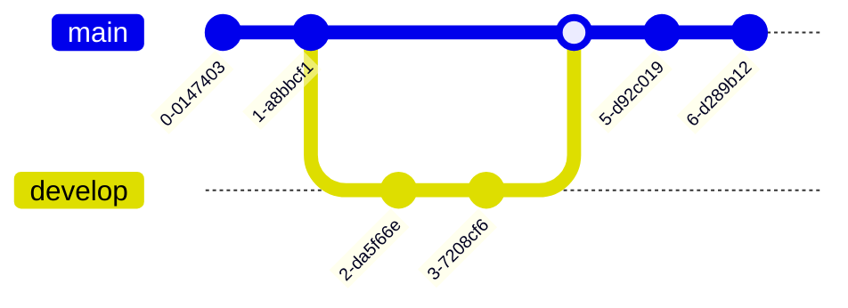

# TESO Fisher
Техническая спецификация 

### СОДЕРЖАНИЕ
- [Введение](#введение)
- [Общее описание](#1-общее-описание-)
- 1 [Системная среда](#11-системная-среда)
- 1.2 [Рыбалка в TESO](#12-рыбалка-в-teso)
- 1.3 [Спецификация функциональных требований](#13-спецификация-функциональных-требований)
- 2 [Подготовка данных](#2-подготовка-данных)
- 2.1 [Текущее положение игрового персонажа](#21-текущее-положение-игрового-персонажа)
- 2.2 [Компас в игре](#22-компас-в-игре)
- 2.3 [Матрица лунок и способов их достижения](#23-матрица-лунок-и-способов-их-достижения)
- 3 [Проектирование](#3-проектирование)
- 3.1 [Функциональные требования](#31-функциональные-требования)
- 3.1.1 [Перемещение персонажа к лунке FRS_TESO_FISHER_010000](#311-перемещение-персонажа-к-лунке-frs_teso_fisher_010000)
- 3.1.2 [Определение наличия рыбы в лунке FRS_TESO_FISHER_020000](#312-определение-наличия-рыбы-в-лунке-frs_teso_fisher_020000)
- 3.1.3 [Автоматически ловить рыбу в лунке FRS_TESO_FISHER_030000](#313-автоматически-ловить-рыбу-в-лунке-frs_teso_fisher_030000)
- 3.2 [Тестовая спецификация](#32-тестовая-спецификация)
[СПИСОК ИСТОЧНИКОВ](#список-источников)

---
### Введение
Обзор: Данная спецификация описывает алгоритм работы TESO Fisher.

Объём проекта: Программное обеспечение TESO Fisher должно обеспечивать автоматическую ловлю рыбы в игре The Elder Scrolls Online. 

Глоссарий:
- ПО – программное обеспечение.
- TESO – название игры The Elder Scrolls Online.

Ссылки:

Обзор продукта:

---

### **1 Общее описание** 

#### **1.1 Системная среда**
Для реализации продукта используется среда разработки PyCharm и объектно-ориентированный язык программирования Python. Также используются следующие библиотеки Python:
- _Keyboard_ обеспечивает полный контроль над клавиатурой
- _Mouse_ обеспечивает полный контроль над мышью;
- _NetworkX_ пакет Python для создания, управления и изучения структуры, динамики и функций сложных сетей (графов);
- _Numpy_ используется для работы с многомерными массивами;
- _Pillow_ обеспечивает поддержку форматов файлов, внутреннее представление и возможности обработки изображений;
- _Pytest_ используется для написания различных типов тестов программного обеспечения.

#### 1.2 Рыбалка в TESO
Игрок появляется в открытом мире, где ему необходимо поймать рыбу (Рисунок 1.1 Игрок в открытом мире).

Рисунок 1.1. Игрок в открытом мире
Для этого необходимо найти лунку с рыбой на карте и подойти к ней (Рисунок 1.2. Лунка с рыбой). 

#### 1.3 Спецификация функциональных требований

---
### 2 Подготовка данных

#### 2.1 Текущее положение игрового персонажа

#### 2.2 Компас в игре

#### 2.3 Матрица лунок и способов их достижения.

---
### 3 Проектирование

#### 3.1 Функциональные требования

#### 3.1.1 Перемещение персонажа к лунке [FRS_TESO_FISHER_010000]()
#### 3.1.2 Определение наличия рыбы в лунке [FRS_TESO_FISHER_020000]()
#### 3.1.3 Автоматически ловить рыбу в лунке [FRS_TESO_FISHER_030000]()
#### 3.2 Тестовая спецификация

---
### СПИСОК ИСТОЧНИКОВ
 

Общее описание 

